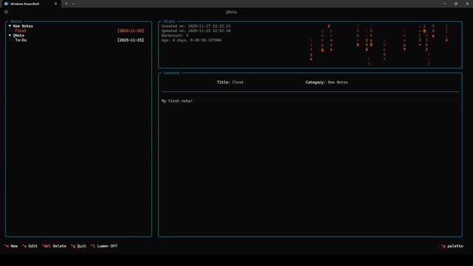

# QNote

QNote is a terminal-based, local-first, note-taking app powered by [Textual](https://github.com/Textualize/textual).  
It provides a fast, intuitive, and visually appealing way to manage your notes directly in the terminal.

[](demo.mp4)
---

## Why another note-taking app?

To solve the bane of my life!

I often struggle to just make a note, simply, no fuss, without spending ages to decide which section of other note-taking
apps to insert it or spending even more time trying to find it later.

Sounds familiar? If so, great, *QNote* is the solution for you! - No need to register, log in, and sign your life away
to never ending data collection, etc... etc...

The mission was simple: make note-taking quick, but manageable!
- One command install
- One command launch
- One hotkey and type away

It's very easy to move your note around or create new categories and to manage it's content.
The app provides metadata which helps you understand what your note is.

---

## Features

- **Terminal UI**: Sidebar, stats panel with *Lumen* - a visual widget, and content area for easy navigation and editing.
- **Intuitive design**: Dynamic hotkeys and keyboard-centric approach.
- **SQLite backend**: Local note storage with fast queries.
- **Cross-platform**: Works on Windows, macOS, and Linux.
- **Console script**: Launch with `qnote` after installation.

---

## Installation

### Using pip (recommended)

```bash
pip install qnote
```

### Runing
```bash
qnote
```

---

If you like the project, please consider giving it a Star!